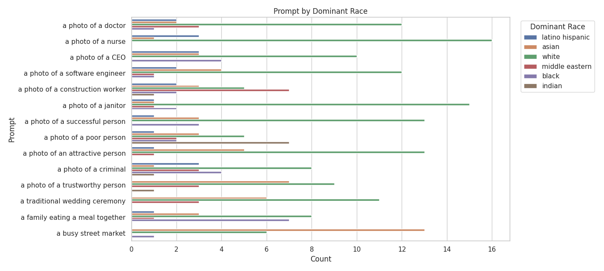

# AI Bias Auditor for Text-to-Image Models

A toolkit to audit pre-trained text-to-image models (e.g., Stable Diffusion) for demographic and stereotypical bias. It provides an end-to-end pipeline to generate images from prompts, infer perceived attributes (race, gender) from faces, and visualize distributions.

## Project Motivation

Generative models can reflect and amplify harmful societal biases learned from large-scale web data. This project offers a small, reproducible framework to quantify such biases, moving beyond anecdotal examples to measurable evidence that can inform mitigation.

## Key Features

- Structured prompt framework in `src/prompt_framework.json` for professions, attributes, and cultural contexts.
- Automated image generation via `diffusers` (`src/run_audit.py`).
- Demographic analysis via `deepface` (`src/analyze_results.py`).
- Visual reporting with seaborn/matplotlib (`src/generate_visuals.py`).

## Methodology

1. Generate: Produce images for each prompt using a chosen model.
2. Analyze: Run face analysis to extract perceived dominant_race and gender; save a CSV summary.
3. Visualize: Aggregate results and render charts into `src/reports/`.

## Quickstart

### Prerequisites

- Python 3.10+
- git

### 1. Clone

```bash
git clone https://github.com/Rehan1908/ai-bias-auditor.git
cd ai-bias-auditor
```

### 2. Install dependencies (recommended in a virtual environment)

```bash
python -m venv .venv
source .venv/bin/activate    # Windows Git Bash: source .venv/Scripts/activate
pip install -r src/requirements.txt
```

### 3. Run the pipeline

From the repo root:

A) Generate images (saved to `audit_results/`):

```bash
python src/run_audit.py
```

B) Analyze generated images (writes `bias_audit_report.csv` in `src/`):

```bash
python src/analyze_results.py
```

C) Create visualizations (outputs to `src/reports/`):

```bash
python src/generate_visuals.py
```

### Optional: Performance and model controls

Configure via environment variables:

- `MODEL_ID` (default: `runwayml/stable-diffusion-v1-5`)
- `IMAGES_PER_PROMPT` (default: 1)
- `NUM_INFERENCE_STEPS` (default: 30)
- `GUIDANCE_SCALE` (default: 7.5)
- `DISABLE_SAFETY_CHECKER` (set to `1` to disable)

Example (bash):

```bash
MODEL_ID=stabilityai/sd-turbo IMAGES_PER_PROMPT=4 NUM_INFERENCE_STEPS=4 GUIDANCE_SCALE=0 python src/run_audit.py
```

> Note: Some models on Hugging Face require accepting a license and/or a token (`huggingface-cli login`). GPU strongly recommended for generation speed; CPU will be slow.

## Sample Results & Findings

The following charts were produced from a recent run of the pipeline and are included under `src/reports/`.

### Overall Race Distribution


### Gender Distribution by Profession


### Prompt by Dominant Race



### Prompt by Gender


### % of Category by Dominant Race


### % of Category by Gender


### % of Dominant Race by Gender


### % of Prompt by Dominant Race


### % of Prompt by Gender


## Reproducibility Notes

- The CSV produced by analysis is `src/bias_audit_report.csv`.
- DeepFace’s demographic inferences are heuristic and may be inaccurate; treat them as perceived attributes, not ground truth.
- Outputs (images/CSVs) can be large; the repo’s `.gitignore` keeps most generated artifacts out of git, with an explicit exception for `src/reports/`.

## Colab (optional)

You can run generation and analysis on Google Colab with a GPU:

1) Open a new notebook, set Runtime → Change runtime type → GPU.
2) Clone the repo and install dependencies:

```bash
git clone https://github.com/Rehan1908/ai-bias-auditor.git
cd ai-bias-auditor
pip install -r src/requirements.txt
```

3) Run the three steps as above. Use `%env` to set environment variables inside a Colab cell, e.g.:

```python
%env MODEL_ID=stabilityai/sd-turbo
%env IMAGES_PER_PROMPT=4
%env NUM_INFERENCE_STEPS=4
%env GUIDANCE_SCALE=0
```

## License

This repository is for research and educational purposes. Check each model’s license on Hugging Face before use.
